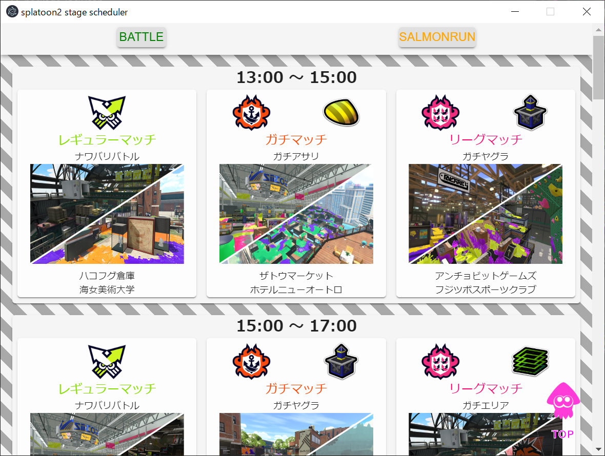
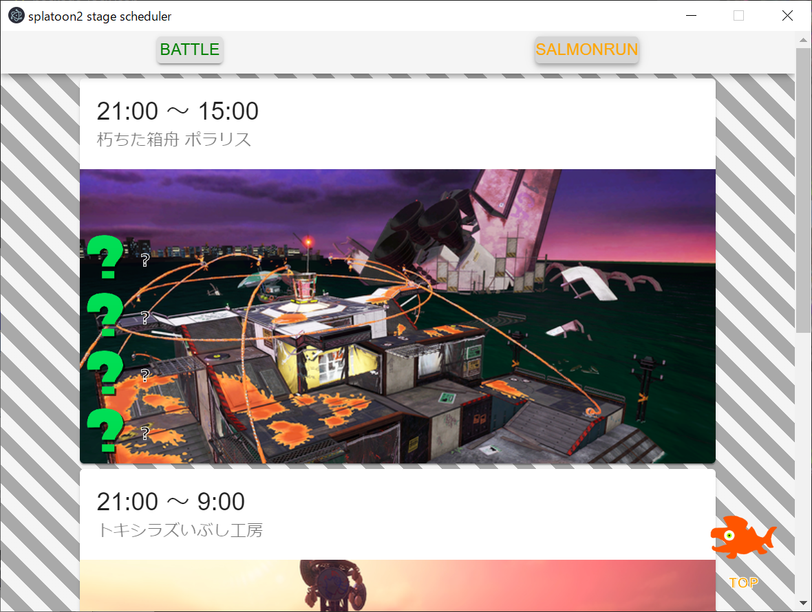

# SplatoonStageScheduler

  

# INFO
スプラトゥーン2のステージ情報を確認できるデスクトップアプリ  
サーモンランにも対応しました。

# special thanks
APIは[yuu26/えむおん](https://twitter.com/m_on_yu)さんのものを使用しています。  
https://spla2.yuu26.com/

# DOWNLOAD
※クリックするとダウンロードが始まります
|OS|LINK|
|---|---|
|Windows|[DOWNLOAD](https://github.com/yotsugi-vip/SplatoonStageScheduler/releases/download/v2.0.0/SplatoonStageScheduler.Setup.2.0.0.exe)|  
Mac|[DOWNLOAD](https://github.com/yotsugi-vip/SplatoonStageScheduler/releases/download/v2.0.0/SplatoonStageScheduler-2.0.0.dmg)|  
Ubuntu|[DOWNLOAD](https://github.com/yotsugi-vip/SplatoonStageScheduler/releases/download/v2.0.0/splatoonstagescheduler_2.0.0_amd64.deb) 

